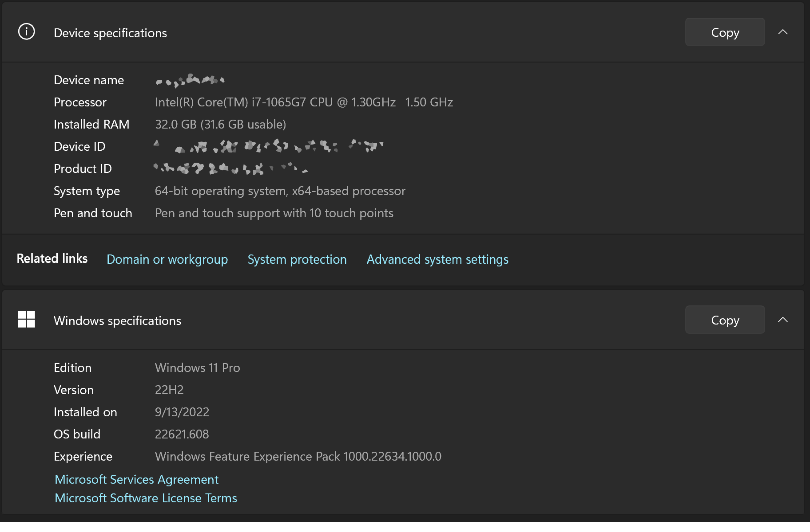
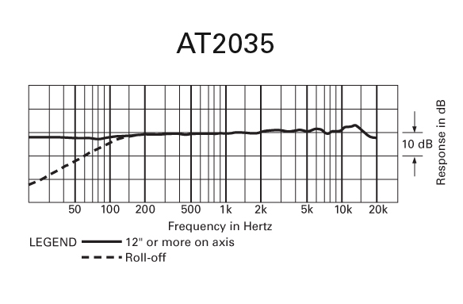
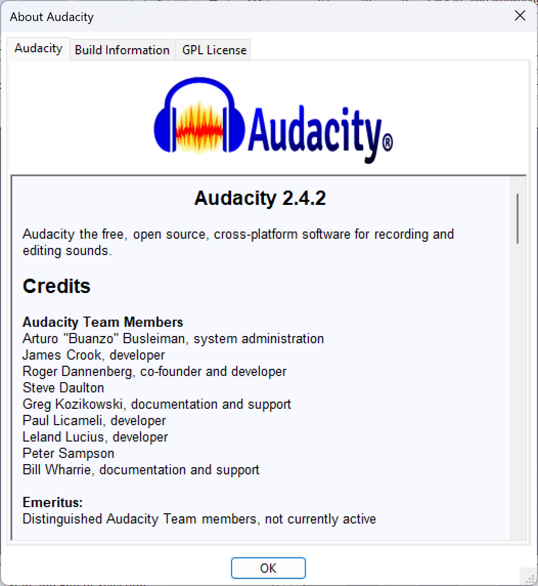

# rivian-meridian-audio-test

# INTRODUCTION
This Rivian R1T and R1S electrical adventure vehicles feature a state-of-the-art audio system from Meridian Audio called [Rivian Elevation](https://www.meridian-audio.com/partners/rivian/). The full product sheet can be seen [here](https://www.meridian-audio.com/media/8d9e24b1af5e762/rivian-r1t-meridian-at-a-glance.pdf).

While the specifications of this audio system are impressive, Rivian limits the audio input sources to the following:
* FM Radio
* Spotify (in-built application)
* Tune-In Radion (in-built application)
* Bluetooth Streaming Audio

At present (October 2022), the Rivian Elevation system does *NOT* support local audio playback from sources such as MP3, AAC, WAV, or FLAC from a local USB source.

This project catalogs and presents the results of real-world audio testing using the currently available sources to determine if they make full use of the capabilities of the Rivian Elevation audio system. 

# AUDIO SAMPLES
The audio samples used in the testing were specifically chosen because they are all available on Spotify, regardless of the playback platform (eg, in-built application or on a mobile telephone).  This allows the testing to proceed by simply recording the playback of the entire Spotify playlist on a new device.

The audio samples include the following:
* A collection of noise (white/pink/brown) test samples
* A collection of frequency response samples that are *roughly* logarithmic across the human hearing spectrum
* A collection of real-world song samples from various genres

Reference Spotify Playlist: https://open.spotify.com/playlist/6XqitHZADq009M9vvkdxmN?si=c710434fffd64c5c

# EQUIPMENT SETTINGS
This section details the conditions & equipment used in the testing.

## Vehicle
* [2022 Rivian R1S Launch Edition](https://rivian.com/r1s) (Meridian Audio)
- Vehicle Firmware 2022.35.03
- Equalizer Set to Default (flat)
- Master Volume Level: 20
- Microphone placement on-dash above center display
- Vehicle Third Row Folded Down

## Capture Computer
Microsoft Surface Book 3 (Microsoft Windows 11, 22H2)

## Audio Interface
Scarlett 2i2 (monoaural recording, channel 1)

## Microphone
Audio Technica AT2035

## Audio Recording Software
Audacity v2.4.2 (Microsoft Windows)

# METHODOLOGY

# RESULTS
