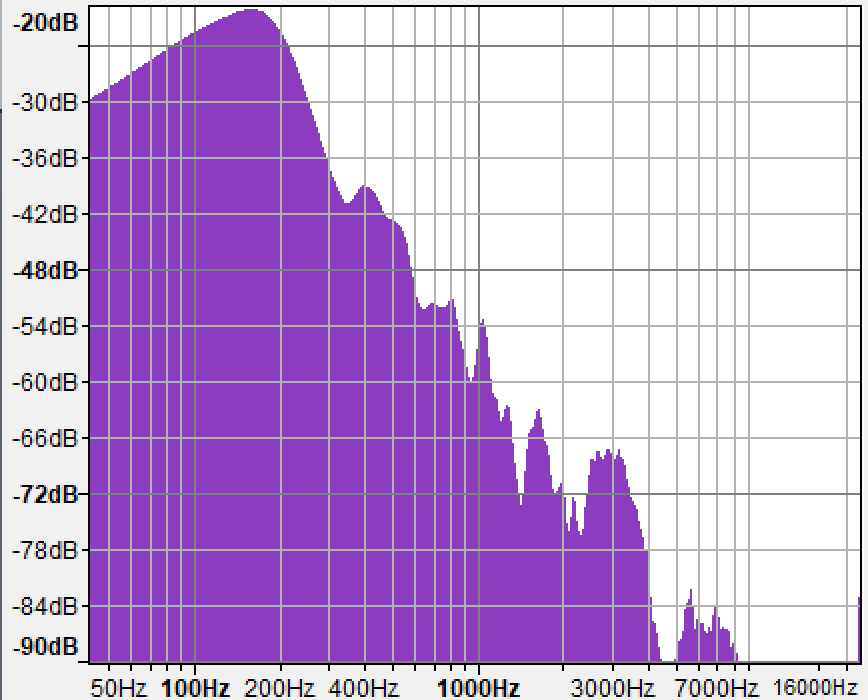
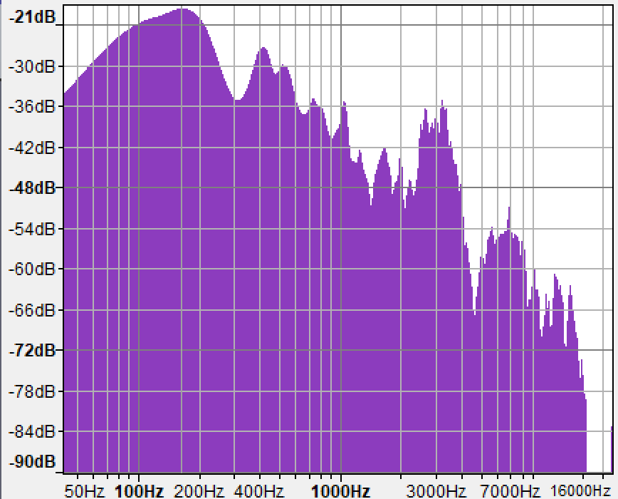

# rivian-meridian-audio-test

# INTRODUCTION
This Rivian R1T and R1S electrical adventure vehicles feature a state-of-the-art audio system from Meridian Audio called [Rivian Elevation](https://www.meridian-audio.com/partners/rivian/). The full product sheet for the Rivian R1T audio system can be seen [here](https://www.meridian-audio.com/media/8d9e24b1af5e762/rivian-r1t-meridian-at-a-glance.pdf).

While the specifications of this audio system are impressive, Rivian limits the audio input sources to the following:
* FM Radio
* Spotify (in-built application)
* Tune-In Radio (in-built application)
* Bluetooth Streaming Audio

At present (October 2022), the Rivian Elevation system does *NOT* support local audio playback from sources such as MP3, AAC, WAV, or FLAC from a local USB source.

This project catalogs and presents the results of real-world audio testing using the currently available sources to determine if they make full use of the capabilities of the Rivian Elevation audio system. 

# AUDIO SAMPLES
The audio samples used in the testing were specifically chosen because they are all available on Spotify, regardless of the playback platform (eg, in-built application or on a mobile telephone).  This allows the testing to proceed by simply recording the playback of the entire Spotify playlist on a new device.

The audio samples include the following:
* A collection of noise (white/pink/brown) test samples
* A collection of frequency response samples that are *roughly* logarithmic across the human hearing spectrum
* A collection of real-world song samples from various genres

Reference Spotify Playlist: https://open.spotify.com/playlist/6XqitHZADq009M9vvkdxmN?si=c710434fffd64c5c

# EQUIPMENT SETTINGS
This section details the conditions & equipment used in the testing.

## Vehicle
[2022 Rivian R1S Launch Edition](https://rivian.com/r1s) (Rivian Elevation Audio)
- Vehicle Firmware 2022.35.03
- Equalizer Set to Default (flat)
- Master Volume Level: 20 (approx -6 dB standardized volume level at microphone)
- Microphone placement on-dash above center display
- Vehicle Third Row Folded Down

## Capture Computer
[Microsoft Surface Book 3](https://www.microsoft.com/en-us/d/surface-book-3/8xbw9g3z71f1) (Microsoft Windows 11, 22H2)

## Audio Interface
[Focusrite Scarlett 2i2](https://focusrite.com/en/usb-audio-interface/scarlett/scarlett-2i2)
* monoaural recording, channel 1 

## Microphone
[Audio Technica AT2035](https://www.audio-technica.com/en-us/at2035) Cardiod Condensor Microphone 

## Audio Recording Software
Audacity v2.4.2 (Microsoft Windows) 

# METHODOLOGY

## Vehicle Cabin Room Tone

## Reference White Noise 

## In-Built Spotify App

## Bluetooth Recording

# RESULTS
## Room Tone

## Pure White Noise (FM Radio)

## Audio Samples
| Sample | In-Built Spotify | Google Pixel 6 (AAC Codec) |
| :---:  | :---:            | :---:          |
| 50Hz Test Tone |  [reference waveform](samples/rivian-r1s-native/50_hz.wav) |  [reference waveform](samples/rivian-r1s-google-pixel-spotify/50_hz.wav) |
| 100Hz Test Tone |  [reference waveform](samples/rivian-r1s-native/100_hz.wav) |  [reference waveform](samples/rivian-r1s-google-pixel-spotify/100_hz.wav) |
| 400Hz Test Tone |  [reference waveform](samples/rivian-r1s-native/400_hz.wav) |  [reference waveform](samples/rivian-r1s-google-pixel-spotify/400_hz.wav) |
| 1000Hz Test Tone |  [reference waveform](samples/rivian-r1s-native/1000_hz.wav) |  [reference waveform](samples/rivian-r1s-google-pixel-spotify/1000_hz.wav) |
| 5000Hz Test Tone |  [reference waveform](samples/rivian-r1s-native/5000_hz.wav) |  [reference waveform](samples/rivian-r1s-google-pixel-spotify/5000_hz.wav) |
| 10000Hz Test Tone |  [reference waveform](samples/rivian-r1s-native/10000_hz.wav) |  [reference waveform](samples/rivian-r1s-google-pixel-spotify/10000_hz.wav) |
| 15000Hz Test Tone |  [reference waveform](samples/rivian-r1s-native/15000_hz.wav) |  [reference waveform](samples/rivian-r1s-google-pixel-spotify/15000_hz.wav) |
| 18000Hz Test Tone |  [reference waveform](samples/rivian-r1s-native/18000_hz.wav) |  [reference waveform](samples/rivian-r1s-google-pixel-spotify/18000_hz.wav) |
| White Noise Test Tone |  [reference waveform](samples/rivian-r1s-native/noise_white.wav) |  [reference waveform](samples/rivian-r1s-google-pixel-spotify/noise_white.wav) |
| Pink Noise Test Tone |  [reference waveform](samples/rivian-r1s-native/noise_pink.wav) |  [reference waveform](samples/rivian-r1s-google-pixel-spotify/noise_pink.wav) |
| Brown Noise Test Tone |  [reference waveform](samples/rivian-r1s-native/noise_brown.wav) |  [reference waveform](samples/rivian-r1s-google-pixel-spotify/noise_brown.wav) |
| Simon & Garfunkel - I am a  Rock |  [reference waveform](samples/rivian-r1s-native/i_am_a_rock.wav) |  [reference waveform](samples/rivian-r1s-google-pixel-spotify/i_am_a_rock.wav) |
| Vienna Teng - Never Look Away |  [reference waveform](samples/rivian-r1s-native/never_look_away.wav) |  [reference waveform](samples/rivian-r1s-google-pixel-spotify/never_look_away.wav) |
| Nirvana - Heart-Shaped Box |  [reference waveform](samples/rivian-r1s-native/heart_shaped_box.wav) |  [reference waveform](samples/rivian-r1s-google-pixel-spotify/heart_shaped_box.wav) |
| Symphony X - The Odyssey |  [reference waveform](samples/rivian-r1s-native/the_odyssey.wav) |  [reference waveform](samples/rivian-r1s-google-pixel-spotify/the_odyssey.wav) |
| Bill Withers - City of the Angels |  [reference waveform](samples/rivian-r1s-native/city_of_the_angels.wav) |  [reference waveform](samples/rivian-r1s-google-pixel-spotify/city_of_the_angels.wav) |
| Tupac - California Love |  [reference waveform](samples/rivian-r1s-native/california_love.wav) |  [reference waveform](samples/rivian-r1s-google-pixel-spotify/california_love.wav) |
| Gravity Kills  - Guilty |  [reference waveform](samples/rivian-r1s-native/guilty.wav) |  [reference waveform](samples/rivian-r1s-google-pixel-spotify/california_love.wav) |
| Orbital - The Box, Part 2 |  [reference waveform](samples/rivian-r1s-native/the_box_pt_2.wav) |  [reference waveform](samples/rivian-r1s-google-pixel-spotify/the_box_pt_2.wav) |
| W.A. Mozart - Symphony 40 in G Minor |  [reference waveform](samples/rivian-r1s-native/mozart_symphony_40_g_minor.wav) |  [reference waveform](samples/rivian-r1s-google-pixel-spotify/mozart_symphony_40_g_minor.wav) |
| Miles Davis - Green in Blue |  [reference waveform](samples/rivian-r1s-native/green_in_blue.wav) |  [reference waveform](samples/rivian-r1s-google-pixel-spotify/green_in_blue.wav) |
