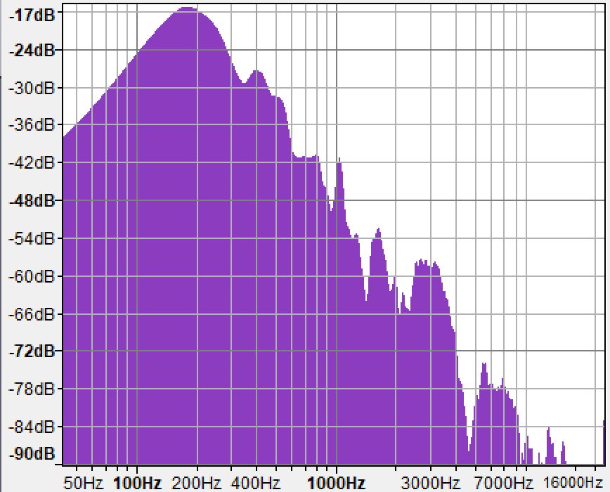

# rivian-meridian-audio-test

# INTRODUCTION
This Rivian R1T and R1S electrical adventure vehicles feature a state-of-the-art audio system from Meridian Audio called [Rivian Elevation](https://www.meridian-audio.com/partners/rivian/). The full product sheet for the Rivian R1T audio system can be seen [here](https://www.meridian-audio.com/media/8d9e24b1af5e762/rivian-r1t-meridian-at-a-glance.pdf).

While the specifications of this audio system are impressive, Rivian limits the audio input sources to the following:
* FM Radio
* Spotify (in-built application)
* Tune-In Radio (in-built application)
* Bluetooth Streaming Audio

At present (October 2022), the Rivian Elevation system does *NOT* support local audio playback from sources such as MP3, AAC, WAV, or FLAC from a local USB source.

This project catalogs and presents the results of real-world audio testing using the currently available sources to determine if they make full use of the capabilities of the Rivian Elevation audio system. 

# AUDIO SAMPLES
The audio samples used in the testing were specifically chosen because they are all available on Spotify, regardless of the playback platform (eg, in-built application or on a mobile telephone).  This allows the testing to proceed by simply recording the playback of the entire Spotify playlist on a new device.

The audio samples include the following:
* A collection of noise (white/pink/brown) test samples
* A collection of frequency response samples that are *roughly* logarithmic across the human hearing spectrum
* A collection of real-world song samples from various genres

Reference Spotify Playlist: https://open.spotify.com/playlist/6XqitHZADq009M9vvkdxmN?si=c710434fffd64c5c

# EQUIPMENT SETTINGS
This section details the conditions & equipment used in the testing.

## Vehicle
[2022 Rivian R1S Launch Edition](https://rivian.com/r1s) (Rivian Elevation Audio)
- Vehicle Firmware 2022.35.03
- Equalizer Set to Default (flat)
- Master Volume Level: 20 (approx -6 dB standardized volume level at microphone)
- Microphone placement on-dash above center display
- Vehicle Third Row Folded Down

## Capture Computer
[Microsoft Surface Book 3](https://www.microsoft.com/en-us/d/surface-book-3/8xbw9g3z71f1) (Microsoft Windows 11, 22H2)

## Audio Interface
[Focusrite Scarlett 2i2 2nd Gen](https://focusrite.com/en/usb-audio-interface/scarlett/scarlett-2i2)
monoaural recording, channel 1 
 

## Microphone
[Audio Technica AT2035](https://www.audio-technica.com/en-us/at2035) Cardioid Condenser Microphone 

## Audio Recording Software
Audacity v2.4.2 (Microsoft Windows) 

# METHODOLOGY
The general methodology for collecting samples is straightforward.  

The vehicle was located in a home garage to reduce the influence of any public atmospheric noise.  The recording micrphone is placed on the center of the vehicle dashboard such that the plane of the cardiod reception field is normal/perpendicular to the output of the speakers (Eg, it is laying on its side).  This prevents overshoot/aliasing of the audio for most sources.

The vehicle is set to a volume level of 20 on the in-dash volume control.

The gain on the USB audio interface is set such that the output of a representative audio source (white noise) corresponds to an average of -6dB level in the recording/monitoring software.

The AC outlets of the vehicle are activated to power the recording computer.  The vehicle is placed in "show and tell mode" so that the center display will not turn off when the cabin door is closed without an occupant.

The recording computer is placed in the cabin on floor of the driver side.

A recording is started in the recording software and then the cabin doors are closed.

From outside the vehicle the Spotify playlist is recorded as one single audio sample with "dead air" / silence placed in between each sample.  This is accomplished by momentarily pausing playback before proceeding to the next sample.  For test tone samples, ten (10) seconds of each sample is recorded.  For genre music samples, the first sixty (60) seconds of each song is recorded.

After collecting all samples, the cabin door is opened and the audio recording is stopped.

For post processing, each sample is separated into a separate track using the audio recording software.  Then, each test tone sample is reduced to a two (2) second sample that contains only the test tone.  For the genre music samples, each is reduced to only the first fifty (50) seconds of each song minus any silence surrounding the music.  The samples are prepared in this way to ensure that no environmental atmospheric noise is captured in the sample.

After post processing, the spectrum analysis plot is prepared in the audio recording software and a screenshot taken.

## Vehicle Cabin Room Tone
All recording spaces have some unavoidable ambient noise.  This can be the ambient sound of an air conditioning unit, standard acoustic echoes in the room, or other ambient noise.  Recording and recognizing the room tone allows the frequency response seen in other samples to account for the natural state of the room in which the sample was recorded.

For this analysis, the Rivian air conditioning unit was disabled but the alternating current (AC) outlets were activated to power the laptop that recorded the samples.  When the AC units are active there is a natural hum (potentially a transformer) that exists in the cabin.  The same recording configuration was used to record the room tone sample as was used for all other sample recording.

## Reference White Noise 
The primary aim of this testing is to determine the actual capabilities of the Rivian Elevation system and then compare that to the provided streaming audio sources such as the in-built Spotify application as well as Bluetooth-based streaming from a mobile phone.  In order to start such a comparison it is important to find some kind of *intrinsic* way of producing wide-frequency output from the Rivian Elevation system.  Given the limited input options the only available way to produce "pure" output is to generate white noise from the FM radio by using a non-broadcasting FM frequency.

## In-Built Spotify App

## Bluetooth Recording
Bluetooth streaming audio connections rely on a piece of software called a "codec."  The word codec comes from the portmanteau of "code/decode" and relays information about the relative quality of the audio that can be used across a given Bluetooth connection.  All devices will have a set of codecs that they support and both the source (the device playing the content) and the sink (the device rendering the content) must negotiate at connection a common codec that they both support.  It is possible for a rendering device to support a very high-fidelity codec but be unable to use it if the source device does not *also* support using that same codec for transmitting the sound.

For a full and thorough treatment of the concept of the various codecs in use today, please see [this article](https://www.soundguys.com/understanding-bluetooth-codecs-15352/).

In short, the most common codec in use in the market today is the AAC codec and while it is capable of rendering high quality lossy audio, its performance varies wildly from device to device (particularly among Android mobile phones).

For context, this project catalogs the Bluetooth codec that was negotiated by the device under test and declares it in the results table below.

# RESULTS

## Room Tone
The Rivian R1S room tone with the AC outlets activated generates a low frequency output that is seen in the low end of all other samples.  When analyzing the frequency response of the system, take into account the impact of this room tone - particularly when analyzing the pure tone (eg, single-frequency) samples.

 
[reference waveform](samples/rivian-r1s-control-audio/r1s_room_tone.wav)

## Pure White Noise (FM Radio)
The Rivian R1S white noise (FM radio static) exhibits a sharp drop in frequency response at approximately 16kHz.  As this is the most "pure" form of frequency generation the system is currently capable of it is reasonable to expect that even lossless sources with frequency content well above 16kHz will not be rendered by the Rivian Elevation system.

 
[reference waveform](samples/rivian-r1s-control-audio/r1s_white_noise_radio.wav)

## Audio Playlists
Spotify:  https://open.spotify.com/playlist/6XqitHZADq009M9vvkdxmN?si=0a64c6c3f39f4b7a
Tidal: https://tidal.com/browse/playlist/82977025-2b75-4170-b9d4-f94ff4bdc3d4

## Audio Samples
| Sample | In-Built Spotify | Google Pixel 6 (AAC Codec) |
| :---:  | :---:            | :---:          |
| 50Hz Test Tone |  [reference waveform](samples/rivian-r1s-native/50_hz.wav) |  [reference waveform](samples/rivian-r1s-google-pixel-spotify/50_hz.wav) |
| 100Hz Test Tone |  [reference waveform](samples/rivian-r1s-native/100_hz.wav) |  [reference waveform](samples/rivian-r1s-google-pixel-spotify/100_hz.wav) |
| 400Hz Test Tone |  [reference waveform](samples/rivian-r1s-native/400_hz.wav) |  [reference waveform](samples/rivian-r1s-google-pixel-spotify/400_hz.wav) |
| 1000Hz Test Tone |  [reference waveform](samples/rivian-r1s-native/1000_hz.wav) |  [reference waveform](samples/rivian-r1s-google-pixel-spotify/1000_hz.wav) |
| 5000Hz Test Tone |  [reference waveform](samples/rivian-r1s-native/5000_hz.wav) |  [reference waveform](samples/rivian-r1s-google-pixel-spotify/5000_hz.wav) |
| 10000Hz Test Tone |  [reference waveform](samples/rivian-r1s-native/10000_hz.wav) |  [reference waveform](samples/rivian-r1s-google-pixel-spotify/10000_hz.wav) |
| 15000Hz Test Tone |  [reference waveform](samples/rivian-r1s-native/15000_hz.wav) |  [reference waveform](samples/rivian-r1s-google-pixel-spotify/15000_hz.wav) |
| 18000Hz Test Tone |  [reference waveform](samples/rivian-r1s-native/18000_hz.wav) |  [reference waveform](samples/rivian-r1s-google-pixel-spotify/18000_hz.wav) |
| White Noise Test Tone |  [reference waveform](samples/rivian-r1s-native/noise_white.wav) |  [reference waveform](samples/rivian-r1s-google-pixel-spotify/noise_white.wav) |
| Pink Noise Test Tone |  [reference waveform](samples/rivian-r1s-native/noise_pink.wav) |  [reference waveform](samples/rivian-r1s-google-pixel-spotify/noise_pink.wav) |
| Brown Noise Test Tone |  [reference waveform](samples/rivian-r1s-native/noise_brown.wav) |  [reference waveform](samples/rivian-r1s-google-pixel-spotify/noise_brown.wav) |
| Simon & Garfunkel - I am a  Rock (Folk) |  [reference waveform](samples/rivian-r1s-native/i_am_a_rock.wav) |  [reference waveform](samples/rivian-r1s-google-pixel-spotify/i_am_a_rock.wav) |
| Vienna Teng - Never Look Away (Pop) |  [reference waveform](samples/rivian-r1s-native/never_look_away.wav) |  [reference waveform](samples/rivian-r1s-google-pixel-spotify/never_look_away.wav) |
| Nirvana - Heart-Shaped Box (Rock) |  [reference waveform](samples/rivian-r1s-native/heart_shaped_box.wav) |  [reference waveform](samples/rivian-r1s-google-pixel-spotify/heart_shaped_box.wav) |
| Symphony X - The Odyssey (Metal) |  [reference waveform](samples/rivian-r1s-native/the_odyssey.wav) |  [reference waveform](samples/rivian-r1s-google-pixel-spotify/the_odyssey.wav) |
| Bill Withers - City of the Angels (R&B) |  [reference waveform](samples/rivian-r1s-native/city_of_the_angels.wav) |  [reference waveform](samples/rivian-r1s-google-pixel-spotify/city_of_the_angels.wav) |
| Tupac - California Love (Rap) |  [reference waveform](samples/rivian-r1s-native/california_love.wav) |  [reference waveform](samples/rivian-r1s-google-pixel-spotify/california_love.wav) |
| Gravity Kills  - Guilty (Industrial) |  [reference waveform](samples/rivian-r1s-native/guilty.wav) |  [reference waveform](samples/rivian-r1s-google-pixel-spotify/california_love.wav) |
| Orbital - The Box, Part 2 (Techno) |  [reference waveform](samples/rivian-r1s-native/the_box_pt_2.wav) |  [reference waveform](samples/rivian-r1s-google-pixel-spotify/the_box_pt_2.wav) |
| W.A. Mozart - Symphony 40 in G Minor (Classical) |  [reference waveform](samples/rivian-r1s-native/mozart_symphony_40_g_minor.wav) |  [reference waveform](samples/rivian-r1s-google-pixel-spotify/mozart_symphony_40_g_minor.wav) |
| Miles Davis - Green in Blue (Jazz) |  [reference waveform](samples/rivian-r1s-native/green_in_blue.wav) |  [reference waveform](samples/rivian-r1s-google-pixel-spotify/green_in_blue.wav) |

# BLUETOOTH CODEC DECLARATIONS
This section presents screen captures of the Bluetooth settings screen on the various devices under test

## Google Pixel 6

